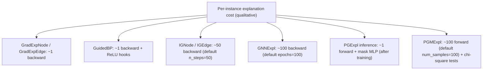

# Comparison of PyTorch Geometric Explainer Implementations for GRADEXPINODE, GRADEXPLEDGE, GUIDEDBP, IGEDGE, IGNODE, GNNEXPL, PGEXPL, PGMEXPL

## Executive summary

This report compares how the requested methods are implemented (or composable) inside entity["organization","PyTorch Geometric","graph ml library"] (“PyG”), focusing on **exact APIs, configuration knobs, I/O contracts, and practical constraints**. The latest stable PyG release on the Python Package Index at the time of writing is **torch-geometric 2.7.0 (released Oct 15, 2025)**, and this report anchors on the **PyG 2.7.0 docs + source-rendered module pages**. citeturn15view0turn19view0turn21view0turn25view5turn31view0

Key takeaways:

- **Only three of the eight names correspond to dedicated PyG explainer algorithm classes**:
  - **GNNEXPL → `torch_geometric.explain.algorithm.GNNExplainer`** citeturn19view0turn21view0  
  - **PGEXPL → `torch_geometric.explain.algorithm.PGExplainer`** citeturn19view1turn21view1  
  - **PGMEXPL → `torch_geometric.contrib.explain.PGMExplainer`** (in `torch_geometric.contrib`) citeturn16search5turn30view0turn31view0  
- The remaining five names (GRADEXPINODE, GRADEXPLEDGE, GUIDEDBP, IGEDGE, IGNODE) are best understood as **specific configurations of**:
  - **`torch_geometric.explain.algorithm.CaptumExplainer`**, which wraps entity["organization","Captum","pytorch interpretability lib"] attribution methods. citeturn20view0turn26view0turn28view0turn32search0turn32search1turn32search2  
- **Training requirements differ sharply**:
  - **GNNExplainer** is *instance-wise optimization* (optimize masks per explained instance). citeturn21view0turn23view4  
  - **PGExplainer** is a *parametric explainer* that **must be trained** (via `algorithm.train(...)`) before `explainer(...)` can be called. citeturn19view1turn25view3turn25view0  
  - **CaptumExplainer** methods are typically “one-shot” attribution (but **Integrated Gradients** scales with `n_steps`, default 50). citeturn26view0turn32search0turn32search18  
  - **PGMExplainer** is *sampling + statistical testing* (default `num_samples=100`) and does **not** learn an edge mask. citeturn30view2turn31view0turn31view5  
- Critical implementation constraints:
  - **CaptumExplainer forces `internal_batch_size=1`** (even if you pass a different value), and its internal `CaptumModel` asserts a singleton “sample” dimension. citeturn26view1turn28view0  
  - **CaptumExplainer only supports `node_mask_type ∈ {None, 'attributes'}`** (by `supports()`), which matters for IGNODE/GuidedBP/GradExpNode. citeturn26view2turn17search0  
  - **PGExplainer supports only `explanation_type='phenomenon'` and does not support node-feature masks** (`node_mask_type` must be `None`). citeturn25view5turn17search0  
  - **PGMExplainer supports classification only** (not regression), supports node- and graph-level tasks, and does not generate edge masks. citeturn31view0turn30view2  

## Scope, naming, and PyG explainability architecture

### PyG’s explainer framework in 2.7.0

PyG’s explainability stack is organized around the **`torch_geometric.explain.Explainer`** front-end and pluggable **`ExplainerAlgorithm`** back-ends. The Explainer object centralizes configuration: explanation type (“model” vs “phenomenon”), mask types for nodes/edges, optional thresholding/postprocessing, and model output semantics via `model_config`. citeturn17search0turn17search1

The **Explainer call signature** (homogeneous or heterogeneous) is:

- `explainer(x, edge_index, *, target=None, index=None, **kwargs) -> Explanation | HeteroExplanation` citeturn17search0  

Important shared concepts:

- **MaskType values** for `node_mask_type` and `edge_mask_type`: `None`, `"object"`, `"common_attributes"`, `"attributes"`. The same options are documented for edges. citeturn17search0  
- **`index`** indicates which row(s) of the model output to explain. For node-level tasks this is typically the **node index**. citeturn17search0turn17search1  
- There is an explicit doc note that if you see “Trying to backward through the graph a second time”, the provided `target` should have been computed under `torch.no_grad()`. citeturn17search0  
- PyG documentation itself flags that the explainability module is in active development and “may not be stable”. citeturn17search0  

### Mapping the requested method names to “official” algorithm identities in PyG

Because several of your method names are “benchmark aliases” rather than PyG class names, the most faithful mapping in PyG 2.7.0 is:

- **GNNEXPL** → `torch_geometric.explain.algorithm.GNNExplainer` citeturn19view0turn21view0  
- **PGEXPL** → `torch_geometric.explain.algorithm.PGExplainer` citeturn19view1turn21view1  
- **PGMEXPL** → `torch_geometric.contrib.explain.PGMExplainer` citeturn16search5turn30view0turn31view0  

And for Captum-derived attributions:

- **GRADEXPINODE** → `CaptumExplainer('Saliency')` with `node_mask_type='attributes'` (node-feature gradients). citeturn20view0turn26view0turn32search1  
- **GRADEXPLEDGE** → `CaptumExplainer('Saliency')` with `edge_mask_type≠None` (edge-mask gradients). citeturn26view0turn28view0turn29view0  
- **GUIDEDBP** → `CaptumExplainer('GuidedBackprop')` (typically configured for node-feature attributions). citeturn20view0turn32search2  
- **IGNODE** → `CaptumExplainer('IntegratedGradients')` with `node_mask_type='attributes'`. citeturn26view0turn32search0turn32search18  
- **IGEDGE** → `CaptumExplainer('IntegratedGradients')` with `edge_mask_type≠None`. citeturn28view0turn29view0turn32search0  

(All of these are supported attribution methods in PyG’s `CaptumExplainer` wrapper, but realized via configuration rather than distinct classes.) citeturn20view0turn26view0

## Comparative table and key differences

The table below summarizes the **implementation-level** differences that matter in practice in PyG 2.7.0.

| Alias | Official method name | PyG implementation (2.7.0) | Category | Typical explanation targets | Outputs (PyG `Explanation`) | Training required | Key constraints / noteworthy behaviors |
|---|---|---|---|---|---|---|---|
| GRADEXPINODE | Saliency (input gradients) | `torch_geometric.explain.algorithm.CaptumExplainer('Saliency', ...)` citeturn20view0turn26view0 | Gradient attribution | Node-feature attribution (node/graph tasks, depends on `task_level` + `index`) | `node_mask` (shape like `x`) citeturn28view0turn29view0turn32search1 | No | `node_mask_type` must be `None` or `'attributes'`; Saliency defaults `abs=True`. citeturn26view2turn32search1 |
| GRADEXPLEDGE | Saliency on edge mask | `CaptumExplainer('Saliency')` with `edge_mask_type≠None` citeturn26view0turn28view0 | Gradient attribution | Edge attribution (importance of edges via differentiable mask variable) | `edge_mask` (shape `[E]`) citeturn28view0turn29view0 | No | Captum edge mask is created as ones with `requires_grad=True`; `CaptumModel` asserts singleton sample dim. citeturn28view0turn29view0 |
| GUIDEDBP | Guided Backpropagation | `CaptumExplainer('GuidedBackprop')` citeturn20view0turn26view0 | Gradient attribution (modified backprop) | Primarily node-feature attributions | `node_mask` (shape like `x`) citeturn28view0turn29view0turn32search2 | No | Captum warns GuidedBP may fail with functional activations; must use module activations like `torch.nn.ReLU`. citeturn32search15turn32search2 |
| IGNODE | Integrated Gradients (node features) | `CaptumExplainer('IntegratedGradients', n_steps=..., ...)` citeturn20view0turn26view0 | Path-integral attribution | Node-feature attribution | `node_mask` (shape like `x`) citeturn29view0turn32search0turn32search18 | No | Default `n_steps=50`, method default `gausslegendre`; PyG overrides `internal_batch_size` to 1. citeturn32search0turn26view1 |
| IGEDGE | Integrated Gradients (edge mask) | `CaptumExplainer('IntegratedGradients')` with `edge_mask_type≠None` citeturn28view0turn26view0 | Path-integral attribution | Edge attributions via edge-mask input | `edge_mask` (shape `[E]`) citeturn29view0turn28view0 | No | Same IG defaults; baseline behavior is handled internally by Captum (PyG passes kwargs through). citeturn26view0turn32search18 |
| GNNEXPL | GNNExplainer | `torch_geometric.explain.algorithm.GNNExplainer(epochs=100, lr=0.01, **coeffs)` citeturn19view0turn21view0 | Optimization-based mask learning | Edge subgraph + node-feature masks (homo + hetero) | `edge_mask` + `node_mask` (and dict variants for hetero) citeturn21view0turn22view2 | Per-instance optimization | Default regularizers: `edge_size=0.005`, entropy terms, sigmoid masks; raises if gradients can’t be computed. citeturn21view0turn23view2turn23view4 |
| PGEXPL | PGExplainer | `torch_geometric.explain.algorithm.PGExplainer(epochs, lr=0.003, **coeffs)` citeturn19view1turn24view1 | Parametric explainer (learned mask generator) | Edge masks for node- or graph-level predictions | `edge_mask` (or dict for hetero) citeturn25view4turn25view5 | **Yes**: must run `algorithm.train(...)` | Supports only `explanation_type='phenomenon'`; node features cannot be explained; cannot be used before fully trained. citeturn25view5turn25view3 |
| PGMEXPL | PGM-Explainer | `torch_geometric.contrib.explain.PGMExplainer(...)` citeturn16search5turn30view2 | Perturbation + statistical test | Node / graph classification; node-subset significance | `node_mask` + `pgm_stats` (p-values) citeturn31view1turn31view5 | No | No edge masks; classification only; uses `pgmpy` chi-square tests; only single `index` supported currently. citeturn31view0turn31view5 |

## Method-by-method implementation analysis

This section provides the detailed, implementation-specific attributes you requested. Unless otherwise noted, the “PyG API” refers to the **2.7.0 documentation and source-rendered code**. citeturn15view0turn19view0turn21view0turn25view5turn30view2

### GRADEXPINODE

**Official name**  
Saliency (gradient of output w.r.t. inputs), typically called **`captum.attr.Saliency`**. citeturn32search1turn32search5  

**Type / category**  
Gradient-based attribution. citeturn32search1turn32search9  

**PyG implementation (exact API + version)**  
- `torch_geometric.explain.algorithm.CaptumExplainer('Saliency', **kwargs)` (PyG explainer algorithm wrapper). citeturn20view0turn26view0turn20view0  
- Used via `torch_geometric.explain.Explainer`. citeturn17search0turn17search1  
- Stable release context: torch-geometric 2.7.0. citeturn15view0  

**Primary use cases**
- Attribution over **node features** (because Captum’s Saliency returns gradients w.r.t. the input tensor). citeturn32search1turn28view0  
- Works for homogeneous or heterogeneous graphs in PyG (CaptumExplainer supports both and constructs `CaptumModel` / `CaptumHeteroModel`). citeturn26view0turn28view0  

**Required inputs and data formats**
- Through `Explainer.__call__`: `x` (tensor `[N,F]` or dict of node-type tensors), `edge_index` (tensor `[2,E]` or dict of edge-type tensors). citeturn17search0  
- For node-level explanations, pass `index=<node_idx>` so the explainer filters to the desired output element (depending on your `model_config.task_level`). citeturn17search0turn17search1  

**Key parameters and default values**
- PyG-level:
  - `CaptumExplainer(attribution_method, **kwargs)` passes `**kwargs` to Captum’s `attribute(...)` call. citeturn20view0turn26view3  
  - **`internal_batch_size` is forcibly set to 1** (if present on the Captum method), and PyG warns if you try to override. citeturn26view1  
- Captum Saliency-level:
  - `abs` default is **True** (returns absolute gradients by default). citeturn32search1turn32search5  

**Preconditions / assumptions**
- Differentiability: the model must be differentiable w.r.t. the input node features used for attribution. This is implicit in Captum’s gradient-based approach. citeturn32search1turn28view0  
- PyG constraint: `node_mask_type` must be `None` or `'attributes'` per `CaptumExplainer.supports()`. For node-feature saliency you need `'attributes'`. citeturn26view2turn17search0  

**Special functionalities**
- You can attribute:
  - Only nodes/features (`node_mask_type='attributes'`, `edge_mask_type=None`) or
  - Both nodes and edges (`node_mask_type='attributes'`, `edge_mask_type` not `None`), because CaptumExplainer selects `MaskLevelType.node_and_edge` when both mask types are specified. citeturn26view0turn29view0  

**Outputs (format, shapes, interpretation)**
- Homogeneous graphs: `Explanation(node_mask=..., edge_mask=...)`. citeturn26view3turn29view0  
- For node-only saliency: `node_mask` is the Captum attribution tensor squeezed to shape `[N, F]`. citeturn29view0turn28view0  
- Interpretation: magnitude indicates sensitivity; signed vs abs depends on `abs` (default abs). citeturn32search1turn32search5  

**Computational complexity / runtime**
- One forward + one backward pass (per explained target), because Saliency is gradient-based. citeturn32search1turn28view0  

**Known limitations / failure modes**
- For binary classification, PyG requires model return type to be probabilities (`return_type='probs'`) for CaptumExplainer. citeturn26view2turn28view0  
- CaptumExplainer’s internal model wrapper asserts a singleton sample dimension (`mask.shape[0] == 1`), so typical batching patterns are constrained. citeturn28view0  

### GRADEXPLEDGE

**Official name**  
Saliency-style gradient attribution, but applied to an **edge mask input** (i.e., gradient of output w.r.t. an edge-importance variable). This is still `captum.attr.Saliency`, but the “input” presented to Captum is an edge mask tensor created by PyG. citeturn28view0turn29view0turn32search1  

**Type / category**  
Gradient-based edge attribution.

**PyG implementation (exact API + version)**
- `CaptumExplainer('Saliency')` with `edge_mask_type` specified (commonly `'object'`). citeturn26view0turn26view0turn17search0  
- Mechanism: `to_captum_input(..., mask_type=edge)` creates a learnable edge-mask input of shape `[E]` with `requires_grad=True`. citeturn28view0turn29view0  

**Primary use cases**
- Edge importance for node-level or graph-level predictions, depending on `model_config.task_level` and the supplied `index`. citeturn17search0turn28view0  

**Required inputs and data formats**
- Same `Explainer` interface: `(x, edge_index, index=..., target=..., **kwargs)`. citeturn17search0  

**Key parameters and default values**
- Captum Saliency: `abs=True` by default. citeturn32search1turn32search5  
- PyG overrides `internal_batch_size` to 1 when applicable (Saliency does not typically rely on IG-style step batching, but the override logic exists). citeturn26view1  

**Preconditions / assumptions**
- The model must use **message passing over edges** such that changes to an edge mask can affect the output. PyG’s Captum edge pathway sets an edge mask into the model via `set_masks(...)`. citeturn28view0turn29view0  

**Special functionalities**
- The edge mask is applied inside the wrapped forward call (`set_masks(self.model, mask.squeeze(0), args[1], apply_sigmoid=False)`). This exposes a differentiable edge-importance channel to Captum. citeturn28view0  

**Outputs**
- Homogeneous: `edge_mask` is `captum_attrs[0].squeeze(0)` → shape `[E]`. citeturn29view0  
- Heterogeneous: `edge_mask_dict` maps each edge type to a `[E_type]` tensor. citeturn29view0turn28view0  

**Computational complexity / runtime**
- Similar to Saliency: one backward pass for attributions, but on large graphs it can still be expensive due to the GNN forward. citeturn32search1turn28view0  

**Known limitations / failure modes**
- As with CaptumExplainer generally: binary classification requires `return_type='probs'`. citeturn26view2turn28view0  
- Edge attributions are sensitive to how `set_masks` is implemented for the model’s layers; if a layer does not respect the installed edge mask, gradients may be uninformative (this is an architectural compatibility issue implied by mask injection). citeturn28view0turn23view2  

### GUIDEDBP

**Official name**  
Guided Backpropagation (`captum.attr.GuidedBackprop`). citeturn32search2turn32search9  

**Type / category**  
Gradient-based attribution with modified ReLU backprop rules (only non-negative gradients). citeturn32search2  

**PyG implementation (exact API + version)**
- `torch_geometric.explain.algorithm.CaptumExplainer('GuidedBackprop', **kwargs)` via `Explainer`. citeturn20view0turn26view0turn17search0  

**Primary use cases**
- Input-feature attribution (node features) for classification tasks; can also be configured for edge attribution by choosing an edge mask input path in PyG (same mechanism as GRADEXPLEDGE). citeturn26view0turn28view0turn32search2  

**Required inputs and data formats**
- Same `Explainer` interface (`x`, `edge_index`, optional `index`, etc.). citeturn17search0  

**Key parameters and default values**
- PyG passes kwargs to the Captum `attribute(...)` method and forces `internal_batch_size=1` if that parameter exists. citeturn26view1turn26view3  
- Captum GuidedBackprop’s core behavior is defined by its overridden ReLU gradient propagation; method-level default knobs are described in Captum’s docs/source. citeturn32search2turn32search6  

**Preconditions / assumptions**
- Model must be differentiable.  
- **Captum-specific structural constraint:** methods requiring backward hooks (including Guided Backpropagation) “will not work appropriately with functional non-linearities” and require module activations (e.g., `torch.nn.ReLU`) instead of `torch.nn.functional.relu`. citeturn32search15turn32search2  

**Special functionalities**
- Compared to vanilla gradients, GuidedBP clamps the backpropagated gradients through ReLU to non-negative, changing the saliency map qualitatively. citeturn32search2  

**Outputs**
- For node-feature guided BP in PyG: `node_mask` has shape `[N, F]` (homogeneous), or per-type `[N_type, F_type]` for hetero. citeturn29view0turn28view0  

**Computational complexity / runtime**
- One backward pass per explanation (like Saliency), but with extra hook logic. citeturn32search2turn32search15  

**Known limitations / failure modes**
- Captum’s documented activation-function limitation is a frequent practical failure mode for PyG models authored with functional activations. citeturn32search15  
- Same PyG CaptumExplainer constraints apply (`node_mask_type` restrictions; binary `return_type='probs'`). citeturn26view2  

### IGNODE

**Official name**  
Integrated Gradients (`captum.attr.IntegratedGradients`). citeturn32search0turn32search18  

**Type / category**  
Gradient path-integral attribution method.

**PyG implementation (exact API + version)**
- `torch_geometric.explain.algorithm.CaptumExplainer('IntegratedGradients', **kwargs)` via `Explainer`. citeturn20view0turn26view0turn17search0  

**Primary use cases**
- Node-feature attribution (`node_mask_type='attributes'`) for node- or graph-level tasks, including heterogeneous graphs (with type dictionaries). citeturn26view0turn17search1turn28view0  

**Required inputs and data formats**
- `x` and `edge_index` as per Explainer. For node-level, set `index=<node_idx>`. citeturn17search0turn17search1  

**Key parameters and default values**
- Captum Integrated Gradients:
  - `n_steps` default **50**. citeturn32search0turn32search18  
  - `method` default **`gausslegendre`** (if no method provided). citeturn32search0turn32search18  
  - The `attribute(...)` signature includes `baselines` with default `None` in Captum’s module source. citeturn32search18  
- PyG CaptumExplainer:
  - If the Captum method has `internal_batch_size`, PyG sets it to **1**. citeturn26view1  

**Preconditions / assumptions**
- Integrated Gradients assumes that interpolating from baseline(s) to inputs is meaningful for your domain. Captum exposes baselines explicitly; PyG does not add additional baseline logic beyond forwarding kwargs through. citeturn26view3turn32search18  

**Special functionalities**
- You can allocate attribution to:
  - nodes/features only (`MaskLevelType.node`) or  
  - nodes+edges (`MaskLevelType.node_and_edge`) if you specify both mask types in the Explainer config; mask-mode selection logic is explicitly handled in PyG. citeturn26view0turn29view0  

**Outputs**
- Homogeneous node IG: `node_mask` is `captum_attrs[0].squeeze(0)` so shape `[N, F]`. citeturn29view0turn28view0  

**Computational complexity / runtime**
- Scales linearly with `n_steps`: roughly **O(n_steps × (forward+backward))**, with default `n_steps=50`. citeturn32search0turn32search18  
- PyG’s forced `internal_batch_size=1` can impact performance for attribution methods that rely on internal batching. citeturn26view1  

**Known limitations / failure modes**
- Same CaptumExplainer constraints: binary classification requires `return_type='probs'`, and node mask type restrictions apply. citeturn26view2turn17search0  

### IGEDGE

**Official name**  
Integrated Gradients applied to the edge-mask input created by PyG (`IntegratedGradients` attribution over the “edge mask” tensor). citeturn28view0turn29view0turn32search0  

**Type / category**  
Path-integral edge attribution.

**PyG implementation (exact API + version)**
- `CaptumExplainer('IntegratedGradients', ...)` with `edge_mask_type` specified (commonly `'object'`). citeturn26view0turn17search0  
- PyG `to_captum_input` constructs the edge mask input tensor as `torch.ones(num_edges, requires_grad=True, device=...)`. citeturn28view0turn29view0  

**Primary use cases**
- Edge-attribution explanations for node- or graph-level predictions, where edges are “turnable” via differentiable masking. citeturn28view0turn17search0  

**Required inputs and data formats**
- Same `Explainer` interface.

**Key parameters and default values**
- Captum IG defaults as above (`n_steps=50`, `method=gausslegendre`). citeturn32search0turn32search18  
- Baseline handling is controlled by Captum’s `baselines` parameter (default `None`); PyG does not specify a separate default baseline for edge masks beyond using Captum’s API. citeturn26view0turn32search18  

**Preconditions / assumptions**
- Edge-mask attribution only makes sense if `set_masks` affects message passing (i.e., the GNN uses edges). PyG injects the mask via `set_masks(..., apply_sigmoid=False)` within the CaptumModel wrapper for edge-mask mode. citeturn28view0  

**Special functionalities**
- You can return both node and edge IG by setting both mask types; PyG converts Captum outputs accordingly. citeturn29view0turn28view0  

**Outputs**
- `edge_mask` is returned as `[E]` for homogeneous graphs; per-edge-type dict for heterogeneous graphs. citeturn29view0turn28view0  

**Computational complexity / runtime**
- Approximately O(`n_steps` × (forward+backward)). With default `n_steps=50`, this is significantly more expensive than Saliency/GuidedBP. citeturn32search0turn32search18  

**Known limitations / failure modes**
- Same CaptumExplainer constraints as above. citeturn26view2turn28view0  

### GNNEXPL

**Official name**  
GNNExplainer (“GNNExplainer: Generating Explanations for Graph Neural Networks”). citeturn19view0turn18academia23  

**Type / category**  
Optimization-based mask learning (learn a soft mask over edges and (optionally) node features per explained instance). citeturn21view0turn23view4  

**PyG implementation (exact API + version)**
- `torch_geometric.explain.algorithm.GNNExplainer(epochs=100, lr=0.01, **kwargs)` (PyG 2.7.0). citeturn19view0turn21view0  
- The original paper is arXiv:1903.03894. citeturn18academia23  

**Primary use cases**
- Instance-level explanations for both:
  - node-level tasks (explain prediction of a node at `index`) and
  - graph-level tasks (explain whole-graph output), depending on `model_config.task_level`. citeturn17search0turn19view0  
- Supports homogeneous and heterogeneous graphs; in the hetero case it builds `node_mask_dict` and `edge_mask_dict`. citeturn21view0  

**Required inputs and data formats**
- Same Explainer interface; internally, GNNExplainer multiplies node features by `sigmoid(node_mask)` when `node_mask_type` is set. citeturn23view0turn22view2  
- If edge masking is enabled, it installs an `edge_mask` into the model using `set_masks` (homo) or `set_hetero_masks` (hetero). citeturn21view0turn23view4  

**Key parameters and default values (PyG 2.7.0)**
- Constructor defaults:
  - `epochs=100`
  - `lr=0.01` citeturn19view0turn21view0  
- Default coefficients used for regularization (`default_coeffs`):
  - `edge_size=0.005`
  - `edge_reduction='sum'`
  - `node_feat_size=1.0`
  - `node_feat_reduction='mean'`
  - `edge_ent=1.0`
  - `node_feat_ent=0.1`
  - `EPS=1e-15` citeturn21view0  

**Preconditions / assumptions**
- Requires gradients through the masks:
  - If node masks are enabled but gradients are `None`, PyG raises an error advising to ensure node features are used, or set `node_mask_type=None`. citeturn23view2  
  - If edge masks are enabled but gradients are `None`, PyG raises an error advising to ensure edges are used via message passing, or set `edge_mask_type=None`. citeturn23view2  

**Special functionalities**
- **Mask shapes depend on `MaskType`:**
  - Homogeneous `node_mask_type='object'` → `[N,1]`
  - `'attributes'` → `[N,F]`
  - `'common_attributes'` → `[1,F]`
  - Edge masks support only `'object'` in this implementation (shape `[E]`). citeturn22view2turn23view1  
- **Sparsity + entropy regularization** is explicitly implemented:
  - Size penalty: `loss += size_coeff * reduce_fn(sigmoid(mask[hard_mask]))`
  - Entropy penalty: `loss += ent_coeff * entropy(mean)` citeturn23view4turn23view3  
- Hard masks are derived from gradient non-zeros on the first iteration (`mask.grad != 0.0`), acting as a limiter over which entries are regularized/considered. citeturn23view2  

**Outputs**
- Homogeneous: `Explanation(node_mask=..., edge_mask=...)`. citeturn21view0  
- Heterogeneous: `HeteroExplanation` with mask dictionaries for each node/edge type. citeturn21view0  
- Returned masks are post-processed via sigmoid (`apply_sigmoid=True` in post-processing). citeturn21view0  

**Computational complexity / runtime**
- Per explained instance: **O(epochs × (forward+backward))**, default epochs=100, with additional overhead from applying masks and regularization. citeturn21view0turn23view4  

**Known limitations / failure modes**
- Primary implementation-level failure modes are the explicit gradient checks described above. citeturn23view2  
- In practice, local optimization and hyperparameter sensitivity are commonly discussed in the GNNExplainer literature; the method is defined as an optimization problem rather than a closed-form attribution. citeturn18academia23turn21view0  

### PGEXPL

**Official name**  
PGExplainer (“Parameterized Explainer for Graph Neural Network”). citeturn19view1turn33search1  

**Type / category**  
Parametric explainer: learns an **explanation network** (MLP) that generates edge masks. citeturn25view1turn24view3turn33search1  

**PyG implementation (exact API + version)**
- `torch_geometric.explain.algorithm.PGExplainer(epochs: int, lr: float = 0.003, **kwargs)` (PyG 2.7.0). citeturn19view1turn24view1  
- The referenced paper is arXiv:2011.04573. citeturn33search1turn24view3  

**Primary use cases**
- Edge explanations for:
  - node-level tasks, and
  - graph-level tasks. citeturn25view5turn19view1  
- Heterogeneous models are supported only for specific architectures listed in code. citeturn24view1turn24view2  

**Required inputs and data formats**
- For both `train(...)` and `forward(...)`: `(model, x, edge_index, target, index=None, **kwargs)` where `x` and `edge_index` can be tensors or hetero dicts. citeturn25view0turn19view1  
- For **node-level** explanations, `index` must be provided and must be a scalar (not a multi-element tensor). citeturn25view0turn25view3  

**Key parameters and default values (PyG 2.7.0)**
- Constructor:
  - `lr` default **0.003**. citeturn19view1  
- Internal coefficients (`coeffs`) with defaults:
  - `edge_size=0.05`
  - `edge_ent=1.0`
  - `temp=[5.0, 2.0]` (temperature schedule endpoints)
  - `bias=0.01` (Concrete sampling bias range) citeturn24view1turn24view2  
- Explanation MLP architecture is explicitly defined as:
  - `Linear(-1, 64) -> ReLU -> Linear(64, 1)` citeturn24view3  

**Preconditions / assumptions**
- **Must be trained**: calling `PGExplainer.forward(...)` before training completes raises a ValueError stating it is not yet fully trained. citeturn25view3turn19view1  
- Supports only **phenomenon explanations** (`explanation_type='phenomenon'`). citeturn25view5  
- Only supports node-level or graph-level task levels. citeturn25view5  
- Does **not** support explaining node features (`node_mask_type` must be `None`). citeturn25view5turn17search0  

**Special functionalities**
- Uses temperature annealing:
  - `_get_temperature(epoch) = temp0 * (temp1/temp0)^(epoch/epochs)` citeturn24view1turn24view2  
- Uses Concrete sampling:
  - `_concrete_sample` perturbs logits via a random eps in `[bias, 1-bias]`. citeturn24view1turn24view2  
- Applies learned masks into the model via `set_masks(..., apply_sigmoid=True)` or `set_hetero_masks(..., apply_sigmoid=True)` during training. citeturn24view2turn25view2  
- For node-level tasks, it computes and uses “hard masks” during training/inference, via `_get_hard_masks(...)`, and slices masks accordingly (mechanism is explicit even if the exact subgraph logic is encapsulated). citeturn25view2turn25view5  
- Heterogeneous support is limited to `HGTConv`, `HANConv`, and `HeteroConv` (as listed in `SUPPORTED_HETERO_MODELS`). citeturn24view1turn24view2  

**Outputs**
- Homogeneous: `Explanation(edge_mask=edge_mask)` where `edge_mask` is post-processed (sigmoid, optional hard masking). citeturn25view4turn25view5  
- Heterogeneous: `HeteroExplanation` with `edge_mask` dict. citeturn25view4  

**Computational complexity / runtime**
- Training: for each `(epoch, instance)` training step, it performs at least one forward through the GNN (and backprop through the explanation network), and applies mask regularization. citeturn25view2turn24view1  
- Inference after training: significantly cheaper than per-instance mask optimization methods, because it uses a learned MLP to generate masks. This amortization motivation aligns with the PGExplainer paper framing. citeturn33search1turn24view3  

**Known limitations / failure modes**
- Using the explainer without completing training triggers a hard error. citeturn25view3  
- Misconfiguration errors are explicit for unsupported explanation types and node mask types. citeturn25view5  
- For node-level tasks, `index` must be scalar; multi-index tensors raise. citeturn25view0turn25view3  

### PGMEXPL

**Official name**  
PGM-Explainer (“PGM-Explainer: Probabilistic Graphical Model Explanations for Graph Neural Networks”). The original paper is arXiv:2010.05788 (NeurIPS 2020). citeturn33search0turn33search5  

**Type / category**  
Perturbation-based, statistical-test-based explainer (builds evidence for node significance through feature perturbations and chi-square conditional-independence testing). citeturn31view5turn33search0  

**PyG implementation (exact API + version)**
- PyG exposes it in the contrib namespace: `torch_geometric.contrib.explain.PGMExplainer` (class listing appears in the PyG index). citeturn16search5turn30view0  
- Under the hood, source is in `torch_geometric.contrib.explain.pgm_explainer.PGMExplainer`. citeturn30view0  
- Important documentation note: PyG’s class docstring currently links to arXiv:1903.03894 (which is the GNNExplainer paper), while the PGM-Explainer paper is arXiv:2010.05788. Treat the algorithm identity as PGM-Explainer per implementation. citeturn30view0turn18academia23turn33search0  

**Primary use cases**
- Node-level classification explanations (`task_level='node'`) and graph-level classification explanations (`task_level='graph'`). citeturn31view0turn31view1  

**Required inputs and data formats**
- `forward(model, x: Tensor, edge_index: Tensor, *, target: Tensor, index: Optional[int|Tensor]=None, **kwargs) -> Explanation`. citeturn31view3turn31view1  
- For node-level explanations, pass `index` (node index). In the implementation, it selects `target[index]`. citeturn31view1  
- It calls the model directly as `model(x, edge_index, **kwargs)` and applies `torch.softmax(..., dim=1)`, so it expects a **classification-like** output tensor shaped like `[N, C]` (node-level) or analogous for graph-level. citeturn30view3turn31view5  

**Key parameters and default values (PyG 2.7.0)**
Constructor signature includes:
- `feature_index: Optional[List]=None` (if None, set to all feature indices at runtime) citeturn31view3turn30view2  
- `perturbation_mode='randint'` citeturn30view2  
- `perturbations_is_positive_only=False` citeturn30view2turn30view3  
- `is_perturbation_scaled=False` citeturn30view2  
- `num_samples=100` citeturn30view2turn31view5  
- `max_subgraph_size=None` (defaults to `int(num_nodes/20)` inside `_explain_graph` if unset) citeturn30view2turn30view3turn31view5  
- `significance_threshold=0.05` citeturn30view2turn31view5  
- `pred_threshold=0.1` citeturn30view2turn31view5  

**Preconditions / assumptions**
- **Classification only**: `supports()` rejects regression mode. citeturn31view0  
- Does not generate edge masks: `supports()` rejects `edge_mask_type != None`. citeturn31view0turn17search0  
- Current implementation supports only a **single** `index` value (if `index` is a tensor with more than one element → `NotImplementedError`). citeturn31view0  
- Requires external packages at runtime:
  - imports `pandas` and `pgmpy.estimators.CITests.chi_square` inside explain routines. citeturn31view5turn30view3  

**Special functionalities**
- For node-level tasks it restricts the candidate region to a k-hop neighborhood:
  - uses `k_hop_subgraph(..., num_hops=get_num_hops(model), ...)`. citeturn31view5  
- Uses chi-square tests to compute p-values and derive dependent nodes:
  - Graph-level explanation does a two-round candidate selection and produces `pgm_stats` as a p-value vector. citeturn31view5turn30view3  

**Outputs (format, shapes, interpretation)**
- Returns `Explanation(node_mask=..., pgm_stats=...)` (and for node-level, also includes `x` and `edge_index` in the returned Explanation). citeturn31view1turn31view4  
- `pgm_stats` is a tensor of p-values (per node), as described in the docstring and code. citeturn30view0turn31view5  
- Node mask creation in graph-level explanation:
  - `node_mask = torch.zeros(x.size(), dtype=torch.int)` and sets selected node rows to 1; shape equals `x.size()` (i.e., `[N, F]`). citeturn31view5  
  This means the “node mask” is effectively a **hard selection of nodes broadcast across features**.

**Computational complexity / runtime**
- Dominated by `num_samples` model forward passes per explanation (default 100), plus chi-square tests; the graph-level routine includes two rounds (seen in code structure). citeturn31view5turn30view3  

**Known limitations / failure modes**
- No edge explanations (by design and enforced by `supports()`). citeturn31view0  
- Sensitivity to perturbation scheme (`perturbation_mode`) and thresholds (`pred_threshold`, `significance_threshold`) is inherent because the algorithm’s decision is based on perturbation outcomes and statistical tests. citeturn30view2turn31view5turn33search0  

## Minimal usage examples in PyG

All snippets below assume you already have a trained PyG model `model` and a `torch_geometric.data.Data` object `data` with at least `data.x`, `data.edge_index`, and labels as needed. The Explainer API and mask-type strings are documented in PyG. citeturn17search0turn17search1

### Shared setup pattern

```python
from torch_geometric.explain import Explainer
```

Your `model_config` must correctly specify:
- `mode` (e.g., `'multiclass_classification'`, `'binary_classification'`, `'regression'`)
- `task_level` (`'node'` or `'graph'`)
- `return_type` (`'raw'`, `'probs'`, `'log_probs'`) citeturn17search0turn17search1turn26view2

### GRADEXPINODE (Saliency node-feature attribution)

```python
from torch_geometric.explain import Explainer, CaptumExplainer

explainer = Explainer(
    model=model,
    algorithm=CaptumExplainer("Saliency", abs=True),
    explanation_type="model",
    node_mask_type="attributes",
    edge_mask_type=None,
    model_config=dict(
        mode="multiclass_classification",
        task_level="node",
        return_type="raw",
    ),
)

explanation = explainer(data.x, data.edge_index, index=10)
node_attr = explanation.node_mask  # shape [num_nodes, num_features]
```

PyG supports Saliency as a Captum attribution method, and Captum’s Saliency defaults `abs=True` if unspecified. citeturn20view0turn26view0turn32search1turn26view2turn29view0

### GRADEXPLEDGE (Saliency edge attribution via edge-mask input)

```python
from torch_geometric.explain import Explainer, CaptumExplainer

explainer = Explainer(
    model=model,
    algorithm=CaptumExplainer("Saliency", abs=True),
    explanation_type="model",
    node_mask_type=None,
    edge_mask_type="object",
    model_config=dict(
        mode="multiclass_classification",
        task_level="node",
        return_type="raw",
    ),
)

explanation = explainer(data.x, data.edge_index, index=10)
edge_attr = explanation.edge_mask  # shape [num_edges]
```

This works because PyG converts the explanation request into Captum inputs where the “input” can be an edge mask with gradients enabled. citeturn28view0turn29view0turn26view0turn17search0

### GUIDEDBP (Guided Backprop node-feature attribution)

```python
from torch_geometric.explain import Explainer, CaptumExplainer

explainer = Explainer(
    model=model,
    algorithm=CaptumExplainer("GuidedBackprop"),
    explanation_type="model",
    node_mask_type="attributes",
    edge_mask_type=None,
    model_config=dict(
        mode="multiclass_classification",
        task_level="node",
        return_type="raw",
    ),
)

explanation = explainer(data.x, data.edge_index, index=10)
node_gbp = explanation.node_mask
```

Captum documents that Guided Backprop overrides ReLU gradients and may not work with functional nonlinearities; if your model uses `torch.nn.functional.relu`, expect potential issues. citeturn32search2turn32search15turn26view0

### IGNODE (Integrated Gradients node-feature attribution)

```python
from torch_geometric.explain import Explainer, CaptumExplainer

explainer = Explainer(
    model=model,
    algorithm=CaptumExplainer("IntegratedGradients", n_steps=50),
    explanation_type="model",
    node_mask_type="attributes",
    edge_mask_type=None,
    model_config=dict(
        mode="multiclass_classification",
        task_level="node",
        return_type="raw",
    ),
)

explanation = explainer(data.x, data.edge_index, index=10)
node_ig = explanation.node_mask
```

Captum’s default `n_steps` is 50 (so specifying it explicitly mainly makes the cost model obvious in code). citeturn32search0turn32search18turn26view0

### IGEDGE (Integrated Gradients edge attribution via edge-mask input)

```python
from torch_geometric.explain import Explainer, CaptumExplainer

explainer = Explainer(
    model=model,
    algorithm=CaptumExplainer("IntegratedGradients", n_steps=50),
    explanation_type="model",
    node_mask_type=None,
    edge_mask_type="object",
    model_config=dict(
        mode="multiclass_classification",
        task_level="node",
        return_type="raw",
    ),
)

explanation = explainer(data.x, data.edge_index, index=10)
edge_ig = explanation.edge_mask
```

PyG’s Captum adapter constructs the edge-mask input and converts Captum outputs into `edge_mask`. citeturn28view0turn29view0turn26view0turn32search0

### GNNEXPL (GNNExplainer)

```python
from torch_geometric.explain import Explainer, GNNExplainer

explainer = Explainer(
    model=model,
    algorithm=GNNExplainer(epochs=100, lr=0.01),
    explanation_type="model",
    node_mask_type="attributes",
    edge_mask_type="object",
    model_config=dict(
        mode="multiclass_classification",
        task_level="node",
        return_type="log_probs",
    ),
)

explanation = explainer(data.x, data.edge_index, index=10)
edge_mask = explanation.edge_mask
node_mask = explanation.node_mask
```

This reflects the documented signature defaults and typical configuration for node classification. citeturn19view0turn17search1turn21view0turn22view2

### PGEXPL (PGExplainer) — includes required training step

```python
from torch_geometric.explain import Explainer, PGExplainer

explainer = Explainer(
    model=model,
    algorithm=PGExplainer(epochs=30, lr=0.003),
    explanation_type="phenomenon",
    node_mask_type=None,          # required: PGExplainer cannot explain node features
    edge_mask_type="object",
    model_config=dict(
        mode="multiclass_classification",
        task_level="node",
        return_type="raw",
    ),
)

# Training the explainer’s internal MLP (must be done before calling explainer(...)):
for epoch in range(30):
    loss = explainer.algorithm.train(
        epoch, model, data.x, data.edge_index, target=data.y, index=10
    )

# Inference (explanation):
explanation = explainer(data.x, data.edge_index, target=data.y, index=10)
edge_mask = explanation.edge_mask
```

PyG explicitly enforces: (1) phenomenon-only explanations, (2) no node mask, and (3) “fully trained” before inference. citeturn19view1turn25view5turn25view3turn25view0

### PGMEXPL (PGMExplainer) — node or graph classification

```python
from torch_geometric.explain import Explainer
from torch_geometric.contrib.explain import PGMExplainer

explainer = Explainer(
    model=model,
    algorithm=PGMExplainer(num_samples=100, significance_threshold=0.05),
    explanation_type="model",
    node_mask_type="attributes",
    edge_mask_type=None,  # required: PGMExplainer does not support edge masks
    model_config=dict(
        mode="multiclass_classification",
        task_level="node",
        return_type="raw",
    ),
)

explanation = explainer(data.x, data.edge_index, index=10)
node_mask = explanation.node_mask
pgm_stats = explanation.pgm_stats
```

PyG’s implementation explicitly forbids edge masks and regression mode. citeturn31view0turn31view1turn30view2

## Runtime and complexity considerations

The scaling behavior below is derived directly from the implementation strategies:

- **Saliency / GuidedBP (GradExp*, GuidedBP)**: ~1 backward pass. citeturn32search1turn32search2  
- **Integrated Gradients (IGNODE/IGEDGE)**: ~`n_steps` backward passes (default `n_steps=50`). citeturn32search0turn32search18  
- **GNNExplainer (GNNEXPL)**: ~`epochs` backward passes (default epochs=100), plus mask regularizers. citeturn21view0turn23view4  
- **PGExplainer (PGEXPL)**:
  - inference is relatively light after training (mask is generated by an MLP), but
  - training requires many passes with backprop to fit the explanation network. citeturn25view2turn25view3turn33search1  
- **PGMExplainer (PGMEXPL)**: ~`num_samples` forward passes (default 100) + chi-square tests; graph-level includes multiple rounds in code. citeturn30view2turn31view5  

A practical “default-config” cost sketch:



IG default steps and GNNExplainer default epochs are explicitly documented in Captum and PyG. citeturn32search0turn21view0turn19view0

## Known limitations and failure modes

This section consolidates the most important failure modes surfaced by PyG’s own guards/logging and Captum’s documented restrictions.

- **CaptumExplainer configuration constraints**:
  - `node_mask_type` must be `None` or `'attributes'` (so object-level or common-attribute node masking is rejected). citeturn26view2turn17search0  
  - For binary classification, model `return_type` must be `'probs'`. citeturn26view2turn28view0  
  - PyG forces `internal_batch_size=1`, which may increase runtime for methods where internal batching matters. citeturn26view1  
  - CaptumModel asserts singleton sample dimension (`mask.shape[0]==1`), constraining batching patterns. citeturn28view0  

- **GuidedBP-specific Captum constraint**:
  - Guided Backpropagation (and related hook-based methods) may not work with **functional** non-linearities; Captum advises using module activations like `torch.nn.ReLU` and avoiding module reuse patterns. citeturn32search15turn32search2  

- **GNNExplainer hard failures (explicitly raised)**:
  - If node features (or node masks) are not used inside the model, gradients on `node_mask` can be `None`, and PyG raises with guidance to disable node masks. citeturn23view2  
  - If edges are not used via message passing, gradients on `edge_mask` can be `None`, and PyG raises with guidance to disable edge masks. citeturn23view2  

- **PGExplainer hard failures and restrictions (explicitly enforced)**:
  - Must be fully trained before inference (`forward` raises if not trained). citeturn25view3  
  - Supports only phenomenon explanation type. citeturn25view5  
  - Does not support node feature explanations (`node_mask_type` must be None). citeturn25view5  
  - Node-level requires scalar `index`. citeturn25view0turn25view3  

- **PGMExplainer hard failures and restrictions (explicitly enforced)**:
  - Does not support edge masks. citeturn31view0  
  - Does not support regression. citeturn31view0  
  - Currently supports only a single `index` (no multi-index). citeturn31view0  
  - Runtime dependency risk: imports `pgmpy` and `pandas` inside explanation routines (missing deps will fail at runtime). citeturn31view5turn30view3  

- **Documentation mismatch worth flagging**
  - PyG’s PGMExplainer source docstring references the GNNExplainer arXiv link (1903.03894), while PGM-Explainer’s paper is arXiv:2010.05788. When citing provenance, use the latter for the algorithm definition. citeturn30view0turn18academia23turn33search0