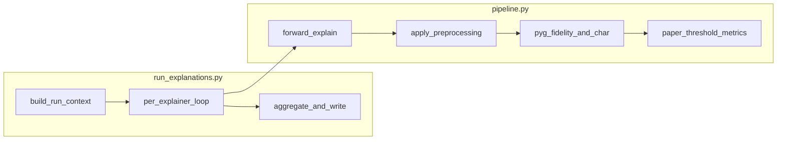

# Split explanation run into substeps + README

## Current architecture (what moves where)

- `[mprov3_explainer/scripts/run_explanations.py](mprov3_explainer/scripts/run_explanations.py)`: CLI, fold/checkpoint resolution, `MProGNN` + loaders, loop over `AVAILABLE_EXPLAINERS`, calls `[run_explanations](mprov3_explainer/src/mprov3_explainer/pipeline.py)` from the package, then **dataset-level means** and JSON I/O.
- Per-graph logic lives in `[pipeline.run_explanations](mprov3_explainer/src/mprov3_explainer/pipeline.py)` (explain → preprocess → PyG `fidelity` / `characterization_score` → `_paper_metrics_from_masks`).
- **Conversion / filtering / normalization** for the stored `Explanation` are in `[apply_preprocessing](mprov3_explainer/src/mprov3_explainer/preprocessing.py)` (`convert_edge_to_node=False` today). **Paper** metrics additionally convert edge→node **inside** `[_paper_metrics_from_masks](mprov3_explainer/src/mprov3_explainer/pipeline.py)` when `node_mask` is missing (lines 143–145), then normalize—so “conversion if needed” matches the paper path, not the preprocessing flag.

## 1. Script: configuration + orchestration substeps

Refactor `[run_explanations.py](mprov3_explainer/scripts/run_explanations.py)` into **small, named functions** (same file to avoid import/path churn):

| Step                            | Responsibility                                                                                                                                                                                                                                                                                                                                                                                                                                                                                                                                                                                                                                                                                                                                                                                                    |
| ------------------------------- | ----------------------------------------------------------------------------------------------------------------------------------------------------------------------------------------------------------------------------------------------------------------------------------------------------------------------------------------------------------------------------------------------------------------------------------------------------------------------------------------------------------------------------------------------------------------------------------------------------------------------------------------------------------------------------------------------------------------------------------------------------------------------------------------------------------------- |
| `parse_args`                    | Existing `_parse_args` (keep or rename).                                                                                                                                                                                                                                                                                                                                                                                                                                                                                                                                                                                                                                                                                                                                                                          |
| `build_explanation_run_context` | Everything that produces a single “run bundle”: validated paths, `k` / `num_folds`, `SplitConfig`, loaders, `device`, `checkpoint_path`, `MProGNN` loaded with defaults from `mprov3_gine_explainer_defaults`, `explainer_results_root`, CLI flags (`split`, `fold_metric`, mask filter). Use a `**@dataclass` (e.g. `ExplanationRunContext`)** holding dataset paths, loaders, model, device, fold index, output roots, and preprocessing/metric flags so “(dataset, class, model, explainer)” is explicit: **dataset** = loaders + snapshot path; **class** = `DEFAULT_OUT_CLASSES` / target handling via model outputs; **model** = `MProGNN` instance; **explainer** = chosen per loop from `AVAILABLE_EXPLAINERS` + `get_spec` / kwargs (mirroring current `explainer_kwargs` / `epochs_for_builder` block). |
| `run_one_explainer`             | For one name: build explainer kwargs, consume `run_explanations(...)`, collect results, print per-graph lines, compute aggregates, write `explanation_report.json` + `masks/`.                                                                                                                                                                                                                                                                                                                                                                                                                                                                                                                                                                                                                                    |
| `write_comparison_report`       | Build `comparison_report.json` from accumulated summaries (unchanged schema).                                                                                                                                                                                                                                                                                                                                                                                                                                                                                                                                                                                                                                                                                                                                     |
| `main`                          | Validate explainers → `ctx = build_explanation_run_context(...)` → loop `run_one_explainer(ctx, name)` → `write_comparison_report`.                                                                                                                                                                                                                                                                                                                                                                                                                                                                                                                                                                                                                                                                               |

No behavior change intended—only structure and docstrings tying each function to the Longa phases.

## 2. Library: align `pipeline.py` with the same substeps

Extract **clear functions** from the body of `[run_explanations](mprov3_explainer/src/mprov3_explainer/pipeline.py)` (still called by the iterator so public API stays `run_explanations(...)` unless you choose to export helpers):

- `**_forward_raw_explanation`**: build `call_kwargs`, time `explainer(...)`, optional MPS float32 coercion (today ~417–432).
- `**_preprocess_for_metrics`**: wrap `apply_preprocessing` + clone masks onto `explanation` (today ~437–456).
- `**_compute_pyg_fidelity**`: `_fidelity_explanation` + `fidelity(...)` (today ~462–474).
- `**_compute_pyg_characterization**`: `characterization_score` on fid+/− (today ~476–493)—this maps to **“framework metrics”** in the sense of PyG’s bundled **characterization** metric.
- **Paper metrics**: split `[_paper_metrics_from_masks](mprov3_explainer/src/mprov3_explainer/pipeline.py)` into:
  - `**_paper_normalized_node_mask_from_explanation`**: edge→node via `edge_mask_to_node_mask` when needed, align/reduce node mask, `normalize_mask` (today 140–151).
  - `**_paper_sufficiency_and_comprehensiveness`**: the threshold loop (today 173–229)—optionally split the loop body into tiny helpers for “subgraph prob vs full prob” to make **sufficiency** vs **comprehensiveness** lines obvious (same math as now: `suf_sum += (full_prob - exp_prob)`, `com_sum += (full_prob - comp_prob)`).
  - `**_paper_f1_fidelity`**: harmonic-style combine from Fsuf/Fcom (today 230–232).
  - `**_paper_metrics_from_masks`**: orchestrates the three above (keeps a single call site from `run_explanations`).

**Mapping to your checklist**

- **Configuration**: script `ExplanationRunContext` + existing `get_spec` / model defaults.
- **Conversion (if needed)**: `edge_mask_to_node_mask` in `[preprocessing.py](mprov3_explainer/src/mprov3_explainer/preprocessing.py)` (mean aggregation); used on the **paper** path when only `edge_mask` exists; preprocessing keeps `convert_edge_to_node=False` unless you explicitly decide to unify (would change PyG subgraph semantics—**out of scope** unless you request it).
- **Filtering**: `_mask_weight_spread` + tolerance in `[apply_preprocessing](mprov3_explainer/src/mprov3_explainer/preprocessing.py)` (max−min before normalization).
- **Normalization**: `normalize_mask` in preprocessing (per mask, per instance).
- **Explain graph**: raw `explainer(...)` in pipeline.
- **Comprehensiveness / sufficiency / F1**: paper loop + `Ff1` helper.
- **Fidelity**: PyG `fidelity` (fid+, fid−), separate from paper scores.
- **Framework metrics**: PyG `characterization_score` from fid+/−.
- **Metrics aggregation**: script means over collected `ExplanationResult` list + `aggregate_fidelity`; document alignment with Longa §5.2.

## 3. Section 5.2 (Longa) and aggregation

The repo PDF at `[doc/2025_Longa_Benchmarking.pdf](doc/2025_Longa_Benchmarking.pdf)` is not text-searchable from the workspace tools here. **Current code** aggregates per explainer with **arithmetic means** over **all** graphs in the split for paper metrics and characterization, while PyG fidelity means use `aggregate_fidelity(..., valid_only=False)` (`[run_explanations.py](mprov3_explainer/scripts/run_explanations.py)` ~234). README should state this explicitly and phrase §5.2 as “instance-level metrics averaged over the evaluation set (see paper)”—if §5.2 prescribes **valid-only** or another rule, adjust means in a follow-up after comparing to the PDF.

## 4. README updates (`[mprov3_explainer/README.md](mprov3_explainer/README.md)`)

Add/expand:

1. **Commands without parameters** — what `uv run python scripts/run_explanations.py` assumes (best fold by test accuracy, test split, default paths, all explainers, mask spread filter on, `paper_n_thresholds=100`).
2. **Command parameters** — expand beyond the table: each flag, defaults, and interaction (e.g. PGEXPL trains on train loader regardless of `--split`).
3. **Explanation substeps** — a short table: step name, one-sentence behavior, **“anchor line”** = the single most important call or definition after refactor (e.g. `apply_preprocessing(...)`, `fidelity(...)`, `_paper_sufficiency_and_comprehensiveness(...)`, `aggregate_fidelity`, JSON writers). Use **stable references** to `[pipeline.py](mprov3_explainer/src/mprov3_explainer/pipeline.py)` / `[preprocessing.py](mprov3_explainer/src/mprov3_explainer/preprocessing.py)` / `[scripts/run_explanations.py](mprov3_explainer/scripts/run_explanations.py)` line ranges once the refactor lands (update line numbers in the same commit).

Keep the existing high-level “Flow” section or merge it with the new substeps table to avoid duplication.

## 5. Constraints

- No new user-facing markdown files beyond README.
- Preserve JSON output shapes and CLI flags.
- Run tests or `uv run python -m py_compile` / ruff if the project uses them (after implementation).

