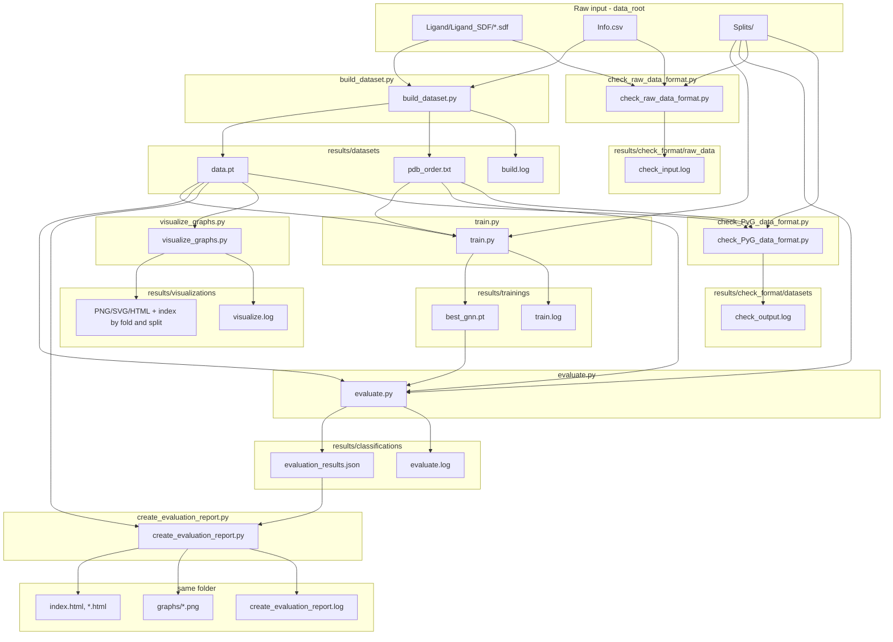
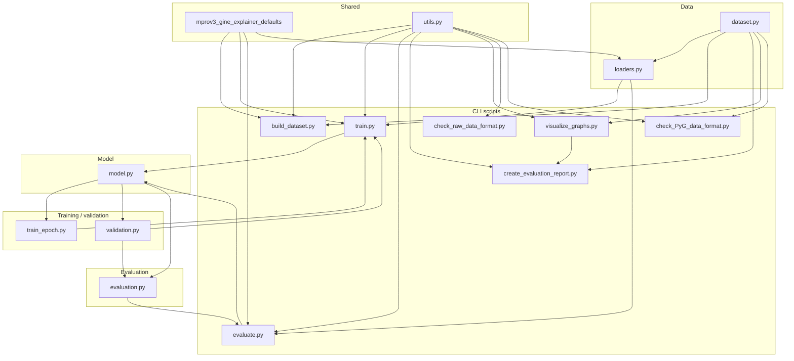

# GNN training for MPro Version 3 data

Python pipeline to train a Graph Neural Network on the MPro-URV Version 3 snapshot for **3-class classification** (Category: low / medium / high potency). The codebase is split into configuration, data loading, GINE model, and separate training, validation, and evaluation logic.

**Shared defaults:** Training, fold, GINE architecture, path segment names, `**SplitConfig`**, `**DEFAULT_DATA_ROOT**`, `**DEFAULT_RESULTS_ROOT**`, and sibling project `**Path`s (`WORKSPACE_ROOT**`, `**GINE_PROJECT_DIR**`, …) come from `**mprov3_gine_explainer_defaults**` (monorepo: parent of the `mprov3_gine_explainer_defaults` folder). The model class is `**MProGNN**` in `**model.py**`.

**Shell orchestration:** End-to-end runs (same step order as repo `check_all.sh` §3, plus optional explainer steps) for smoke tests, a single CV fold, or all folds live under [**`scripts/mprov3/`**](../scripts/mprov3/README.md) (`smoke_gine_explainer.sh`, `run_gine_fold.sh`, `run_gine_explainer_fold.sh`, etc.). See that README for `SKIP_SYNC`, `NUM_FOLDS`, `GNN_TRAIN_EPOCHS`, and the **`-m` / `--include-misclassified`** flag for explainer runs.

## Overview

### Pipeline: scripts, inputs and outputs

All outputs go under fixed paths in `results/` (no per-run timestamp folders). Re-running a step logs **`[INFO] Output exists; overwriting …`** and replaces prior files in that location.




### Code layout: modules and entry points




## Data

- **Graphs**: One graph per ligand from `Ligand/Ligand_SDF/*.sdf`. Node features: 3D coordinates (x, y, z) and atomic number. Edges: bonds; edge features: bond type (single=1, double=2, triple=3, aromatic=1.5) for GINE.
- **Labels**: `Info.csv` provides `pIC50` and `Category` (-1: pIC50<5.5, 0: 5.5≤pIC50<6.5, 1: pIC50≥6.5). Category is mapped to classes 0, 1, 2.

## Results layout

All script outputs live under `**results/`** (config: `DEFAULT_RESULTS_ROOT`) at **fixed paths** below. Re-running overwrites existing outputs after an **`[INFO]`** log line where applicable.

**Migration:** Older timestamped trees such as `results/datasets/<YYYY-MM-DD_HHMMSS>/` are **not** read automatically. Move `data.pt` and `pdb_order.txt` into `results/datasets/`, or delete old folders and run `build_dataset.py` again. Do the same pattern for `trainings/`, `classifications/`, etc.

| Path                                         | Written by                                                                                 | Log file                                       |
| -------------------------------------------- | ------------------------------------------------------------------------------------------ | ---------------------------------------------- |
| `results/datasets/`                          | `build_dataset.py` (`data.pt`, `pdb_order.txt`)                                            | `build.log`                                    |
| `results/trainings/`                         | `train.py` (`best_gnn.pt`)                                                                 | `train.log`                                    |
| `results/classifications/`                   | `evaluate.py` (`evaluation_results.json`), `create_evaluation_report.py` (HTML, `graphs/`) | `evaluate.log`, `create_evaluation_report.log` |
| `results/visualizations/`                    | `visualize_graphs.py` (fold → train/val/test plan; one draw per graph; `index.html` grouped by fold and split) | `visualize.log`                                |
| `results/check_format/datasets/`             | `check_PyG_data_format.py` (log only)                                                      | `check_output.log`                             |
| `results/check_format/raw_data/`             | `check_raw_data_format.py` (log only)                                                      | `check_input.log`                              |

Raw input (MPro snapshot with `Info.csv`, `Ligand/`, `Splits/`) stays at `--data_root` (default: `config.DEFAULT_DATA_ROOT`). Splits are always read from that raw root. Shared helpers (HTML, run logging, overwrite notices) live in `**utils.py`**.

## Setup

Using [uv](https://docs.astral.sh/uv/) (recommended):

```bash
cd mprov3_gine
uv sync
```

Or with pip:

```bash
pip install -r requirements.txt
```

Requires: PyTorch, PyTorch Geometric, RDKit, pandas, numpy, scikit-learn.

---

## Usage

### 0. Validate raw input (optional but recommended)

Before building the dataset, you can check that your raw MPro snapshot has the expected layout and that SDFs/labels/splits parse correctly. The **built** PyG dataset is validated later (after step 1).

```bash
# Default data_root = config.DEFAULT_DATA_ROOT
uv run python check_raw_data_format.py

# Custom raw data path
uv run python check_raw_data_format.py --data_root /path/to/mprov3_data
```

If the check fails, the script exits with code 1 and prints `[ERROR]` lines. Log is written to `results/check_format/raw_data/check_input.log`.

### 1. Build the PyG dataset (required once)

Train/val/test loaders use a **pre-built** PyG dataset. Create it from SDFs and `Info.csv` before training. Output is written to **`results/datasets/`** (overwrites `data.pt` / `pdb_order.txt` after an info line if they exist).

```bash
# Default: data_root = config.DEFAULT_DATA_ROOT, output = results/datasets/
uv run python build_dataset.py

# Custom raw data path and results root
uv run python build_dataset.py --data_root /path/to/mprov3_data --results_root results
```

Output: `results/datasets/data.pt`, `pdb_order.txt`, `build.log`. If you skip this step, training will exit with an error telling you to run `build_dataset.py` first.

#### 1.1. Validate built dataset (optional)

After building, you can verify that the PyG dataset and split indices are compatible with training/evaluation. By default this uses **`results/datasets/data.pt`** and `--splits_root` for the raw snapshot (Splits/).

```bash
# Default: results/datasets/, splits from config.DEFAULT_DATA_ROOT
uv run python check_PyG_data_format.py

# Custom splits location (raw MPro snapshot)
uv run python check_PyG_data_format.py --splits_root /path/to/mprov3_data
```

Log is written to `results/check_format/datasets/check_output.log`.

### 2. Visualize ligand graphs (visualize_graphs.py)

Draws ligand graphs using **RDKit's 2D drawer** (MolDraw2D) for publication-quality figures. By default loads **`results/datasets/data.pt`** and walks **each CV fold** from raw `Splits/` with sub-order **train → val → test**, using **`pdb_order.txt`** order inside each split when present. **Each dataset graph is drawn at most once** (first time it appears in that walk); **`index.html`** still lists every planned **(fold, split)** slot, so the same PDB can show up under multiple headings as duplicate thumbnails linking to the same PNG/HTML. Writes to **`results/visualizations/`**. **Category is shown in the original scale (-1, 0, 1)** (low / medium / high potency). Layout uses **(x, y) only** (z is dropped). Bond styles follow chemistry conventions: single = one central line; double = two shifted lines; triple = two shifted lines plus one central line; aromatic = dashed.

```bash
# Default: full plan (all folds × train/val/test), one draw per unique graph
uv run python visualize_graphs.py

# At most N index rows (and first-time draws) per (fold, train|val|test) bucket
uv run python visualize_graphs.py --num-graphs-by-fold 32

# Select by dataset indices (overrides default plan and per-fold cap)
uv run python visualize_graphs.py --indices 0 1 2 10 25

# Also write vector SVG files (for figures)
uv run python visualize_graphs.py --svg
```

Output under `**results/visualizations/**`:

- `PDB_ID.png`: 2D drawing (RDKit MolDraw2D).
- `PDB_ID.svg`: vector graphic (only with `--svg`).
- `PDB_ID.html`: report with PDB ID, category (-1/0/1), pIC50, and tables for nodes (atomic number, x, y, z) and edges (bond type).
- `index.html`: thumbnails **grouped by fold, then train / val / test** (from raw `Splits/`); `visualize.log`: run log.

### 3. Train (train.py)

Training loads **`results/datasets/data.pt`** and reads splits from **three files** in `data_root/Splits/`:

- **Default file names**: `train_index_folder.txt`, `valid_index_folder.txt`, `test_index_folder.txt`
- Each file must contain **num_folds** lists of PDB IDs (one list per fold). Default **num_folds** is **5**.

```bash
# Default: data_root = config.DEFAULT_DATA_ROOT, output = results/trainings/
uv run python train.py

# Custom raw data path (for Splits/)
uv run python train.py --data_root /path/to/mprov3_data
```

#### Split files and folds

```bash
# Override split file names
uv run python train.py --train_split_file train_index_folder.txt --val_split_file valid_index_folder.txt --test_split_file test_index_folder.txt

# Number of folds (default: 5) and which fold to use (0 .. num_folds-1)
uv run python train.py --num_folds 5 --fold_index 2
```

#### Training options

```bash
# Epochs, batch size, learning rate, seed
uv run python train.py --epochs 150 --batch_size 16 --lr 5e-4 --seed 42

# Number of classes (default 3)
uv run python train.py --num_classes 3
```

#### GINE model (architecture)

```bash
# Hidden size, depth, dropout
uv run python train.py --hidden 128 --num_layers 4 --dropout 0.2
```

#### Full example

```bash
uv run python build_dataset.py --data_root /path/to/mprov3_data
uv run python train.py \
  --data_root /path/to/mprov3_data \
  --num_folds 5 --fold_index 0 \
  --epochs 100 --batch_size 32 --lr 1e-3 \
  --hidden 64 --num_layers 3 --dropout 0.2 \
  --num_classes 3 --seed 42
```

The best model (by validation accuracy) is saved as `results/trainings/best_gnn.pt`. Training does not run evaluation; use `evaluate.py` for that.

### 4. Evaluate (evaluate.py) — run independently

Evaluate a saved checkpoint on the test set without running training. Uses **`results/trainings/best_gnn.pt`** and **`results/datasets/data.pt`**. Use the same split/fold and model architecture as when the model was trained. **Categories are reported in the original scale (-1, 0, 1)** (low / medium / high potency). Results are saved to **`results/classifications/evaluation_results.json`** for use by the evaluation report script.

```bash
# Default: results/trainings/ and results/datasets/, output = results/classifications/
uv run python evaluate.py

# Custom data root (for Splits/) and checkpoint filename (under results/trainings/)
uv run python evaluate.py --data_root /path/to/snapshot --checkpoint best_gnn.pt

# Same fold and architecture as training
uv run python evaluate.py --data_root /path/to/snapshot --fold_index 2 --hidden 64 --num_layers 3 --num_classes 3
```

Options: `--data_root`, `--results_root`, `--checkpoint` (filename in `results/trainings/`), `--train_split_file`, `--val_split_file`, `--test_split_file`, `--num_folds`, `--fold_index`, `--batch_size`, `--hidden`, `--num_layers`, `--dropout`, `--num_classes` (must match the trained model).

#### 4.1. Evaluation report (create_evaluation_report.py)

After running `evaluate.py`, generate an HTML report with graph thumbnails and per-sample real vs predicted category. By default uses **`results/classifications/evaluation_results.json`** and writes the report into that same folder.

```bash
# Uses results/classifications/evaluation_results.json
uv run python create_evaluation_report.py

# Custom results file
uv run python create_evaluation_report.py --results path/to/evaluation_results.json
```

Output is written into the same `**results/classifications/**` folder as the JSON:

- `**index.html**`: index page with thumbnail links; each card shows PDB ID, real category, predicted category, and correct/incorrect.
- `**graphs/<PDB_ID>.png**`: graph image per test sample.
- `**<PDB_ID>.html**`: per-sample page with image, PDB ID, real category (-1/0/1), predicted category (-1/0/1).
- `**create_evaluation_report.log**`: run log.

---

### Programmatic use

You can reuse configs, loaders, and train/val/test logic in your own scripts.

#### Configuration

- `**SplitConfig**` (from `**mprov3_gine_explainer_defaults**`): train/val/test file names (`train_file`, `val_file`, `test_file`), `num_folds`, `fold_index`, `dataset_name` (use `BUILT_DATASET_FOLDER_NAME` / `"."` with `results/datasets` as loader root).
- **Training hyperparameters** (`epochs`, `batch_size`, `lr`, `seed`): defaults from `**mprov3_gine_explainer_defaults`**; `train.py` uses argparse (see `DEFAULT_TRAINING_EPOCHS`, `DEFAULT_BATCH_SIZE`, `DEFAULT_TRAINING_LR`, `DEFAULT_SEED`).
- `**model.MProGNN**`: GINE architecture; construct with hyperparameters (defaults align with `**mprov3_gine_explainer_defaults**` e.g. `DEFAULT_IN_CHANNELS`, `DEFAULT_HIDDEN_CHANNELS`, …).

#### Data loaders

- `**loaders.collate_batch(batch)**`: collate list of PyG graphs into a batch (includes category labels; pIC50 still in data for reference).
- `**loaders.create_data_loaders(dataset_root, data_root, split_config, batch_size=32)**`: loads the PyG dataset from `dataset_root/split_config.dataset_name` (typically `dataset_root = results/datasets`, `dataset_name = "."` from `BUILT_DATASET_FOLDER_NAME`) and returns `(train_loader, val_loader, test_loader)` using split files from `data_root/Splits/` and `fold_index`.

#### Training

- `**train_epoch.train_one_epoch(model, loader, optimizer, device, criterion_ce)**`: one training epoch (cross-entropy); returns mean loss.

#### Validation

- `**validation.evaluate_validation(model, loader, device)**`: returns `**ValidationMetrics**` (`accuracy`).

#### Evaluation

- `**evaluation.evaluate_test(model, loader, device)**`: returns `**TestMetrics**` (`accuracy`).
- `**evaluation.evaluate_test_with_predictions(model, loader, device)**`: returns `**(TestMetrics, list of (pdb_id, real_category, pred_category))**` with categories in original scale (-1, 0, 1).
- `**evaluation.print_test_report(metrics)**`: prints test accuracy.

#### Example script

```python
from pathlib import Path
import torch
from mprov3_gine_explainer_defaults import (
    BUILT_DATASET_FOLDER_NAME,
    DEFAULT_BATCH_SIZE,
    DEFAULT_DROPOUT,
    DEFAULT_EDGE_DIM,
    DEFAULT_HIDDEN_CHANNELS,
    DEFAULT_IN_CHANNELS,
    DEFAULT_NUM_LAYERS,
    DEFAULT_OUT_CLASSES,
    DEFAULT_POOL,
    DEFAULT_TRAINING_EPOCHS,
    DEFAULT_TRAINING_LR,
    SplitConfig,
)
from loaders import create_data_loaders
from model import MProGNN
from train_epoch import train_one_epoch
from validation import evaluate_validation
from evaluation import evaluate_test, print_test_report

data_root = Path("/path/to/mprov3_data")  # raw snapshot (Splits/, Info.csv)
dataset_base = Path("results/datasets")  # run build_dataset.py first
dataset_name = BUILT_DATASET_FOLDER_NAME
split_config = SplitConfig(num_folds=5, fold_index=0, dataset_name=dataset_name)
epochs = DEFAULT_TRAINING_EPOCHS
batch_size = DEFAULT_BATCH_SIZE
lr = DEFAULT_TRAINING_LR
model = MProGNN(
    in_channels=DEFAULT_IN_CHANNELS,
    hidden_channels=DEFAULT_HIDDEN_CHANNELS,
    num_layers=DEFAULT_NUM_LAYERS,
    dropout=DEFAULT_DROPOUT,
    out_classes=DEFAULT_OUT_CLASSES,
    pool=DEFAULT_POOL,
    edge_dim=DEFAULT_EDGE_DIM,
)

train_loader, val_loader, test_loader = create_data_loaders(
    dataset_base, data_root, split_config, batch_size=batch_size
)
device = torch.device("cuda" if torch.cuda.is_available() else "cpu")
model = model.to(device)
optimizer = torch.optim.Adam(model.parameters(), lr=lr)
criterion_ce = torch.nn.CrossEntropyLoss()

# Training loop (simplified)
for epoch in range(1, epochs + 1):
    train_one_epoch(model, train_loader, optimizer, device, criterion_ce)
    val_metrics = evaluate_validation(model, val_loader, device)
    # ... save best model by val_metrics.accuracy, etc.

ckpt_path = Path("results/trainings/best_gnn.pt")
model.load_state_dict(torch.load(ckpt_path))
test_metrics = evaluate_test(model, test_loader, device)
print_test_report(test_metrics)
```

---

## Layout


| File                            | Role                                                                                                                                                                                |
| ------------------------------- | ----------------------------------------------------------------------------------------------------------------------------------------------------------------------------------- |
| **model.py**                    | GINE model: `MProGNN` (hyperparameter defaults align with `mprov3_gine_explainer_defaults`).                                                                                        |
| **dataset.py**                  | Helpers: `sdf_to_graph`, `load_activity_and_category`; `load_splits` (three files); `get_train_val_test_indices`; `MProV3Dataset` (loads pre-built PyG dataset, errors if missing). |
| **utils.py**                    | `log_overwrite_if_exists`, `log_overwrite_dir_if_nonempty`, `html_escape()`, `html_document()`, `RunLogger` (tee to file + stdout).                                                 |
| **build_dataset.py**            | Builds PyG dataset to `results/datasets/`; writes `build.log`.                                                                                                                      |
| **check_raw_data_format.py**    | CLI: validate raw dataset at `--data_root`; writes `results/check_format/raw_data/check_input.log`.                                                                               |
| **check_PyG_data_format.py**    | CLI: validate built dataset at `results/datasets/data.pt` by default; writes `results/check_format/datasets/check_output.log`.                                                      |
| **loaders.py**                  | `collate_batch`, `create_data_loaders(dataset_root, data_root, ...)` (dataset under `results/datasets/`, splits from raw root).                                                     |
| **train_epoch.py**              | One-epoch training step: `train_one_epoch`.                                                                                                                                         |
| **validation.py**               | Validation: `evaluate_validation`, `ValidationMetrics`.                                                                                                                             |
| **evaluation.py**               | Evaluation: `evaluate_test`, `TestMetrics`, `print_test_report`.                                                                                                                    |
| **train.py**                    | CLI: load `results/datasets/data.pt`, train; save to `results/trainings/` and `train.log`.                                                                                          |
| **evaluate.py**                 | CLI: load `results/trainings/best_gnn.pt`, evaluate; save to `results/classifications/` and `evaluate.log`.                                                                          |
| **create_evaluation_report.py** | CLI: read `results/classifications/evaluation_results.json`, write HTML report into that folder; `create_evaluation_report.log`.                                                    |
| **visualize_graphs.py**         | CLI: read `results/datasets/data.pt`; default plan follows splits (fold × train/val/test); optional `--num-graphs-by-fold` caps each split bucket; write `results/visualizations/` and `visualize.log`.   |


