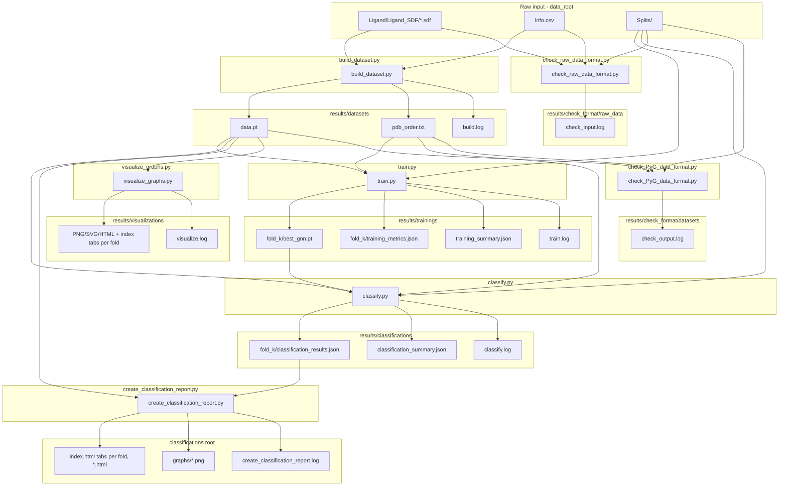
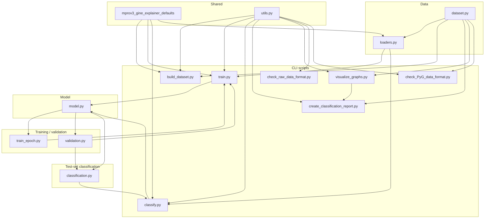

# GNN training for MPro Version 3 data

Python pipeline to train a Graph Neural Network on the MPro-URV Version 3 snapshot for **3-class classification** (Category: low / medium / high potency). The codebase is split into configuration, data loading, GINE model, and separate training, validation, and test-set classification logic.

**Shared defaults:** Training, fold, GINE architecture, path segment names, `**SplitConfig`**, `**DEFAULT_DATA_ROOT**`, `**DEFAULT_RESULTS_ROOT**`, and sibling project `**Path`s (`WORKSPACE_ROOT**`, `**GINE_PROJECT_DIR**`, …) come from `**mprov3_gine_explainer_defaults**` (monorepo: parent of the `mprov3_gine_explainer_defaults` folder). The model class is `**MProGNN**` in `**model.py**`.

**End-to-end check:** From the repository root, run [`check_all.sh`](../check_all.sh) to run `uv sync`, validate shared defaults, the `mprov3_gine` pipeline (README steps 1–7 below with default paths), and the explainer scripts in [`mprov3_explainer`](../mprov3_explainer/README.md). Override training length with `GNN_TRAIN_EPOCHS` (see `check_all.sh` header). For explainer-only flags (e.g. **`--include-misclassified`**), see `mprov3_explainer` CLI help.

## Overview

### Pipeline: scripts, inputs and outputs

All outputs go under fixed paths in `results/` (no per-run timestamp folders). Re-running a step logs **`[INFO] Output exists; overwriting …`** and replaces prior files in that location.




### Code layout: modules and entry points




## Data

- **Graphs**: One graph per ligand from `Ligand/Ligand_SDF/*.sdf`. Node features: 3D coordinates (x, y, z) and atomic number. Edges: bonds; edge features: bond type (single=1, double=2, triple=3, aromatic=1.5) for GINE.
- **Labels**: `Info.csv` provides `pIC50` and `Category` (-1: pIC50<5.5, 0: 5.5≤pIC50<6.5, 1: pIC50≥6.5). Category is mapped to classes 0, 1, 2.

## Results layout

All script outputs live under `**results/`** (config: `DEFAULT_RESULTS_ROOT`) at **fixed paths** below. Re-running overwrites existing outputs after an **`[INFO]`** log line where applicable.

**Migration:** Older timestamped trees such as `results/datasets/<YYYY-MM-DD_HHMMSS>/` are **not** read automatically. Move `data.pt` and `pdb_order.txt` into `results/datasets/`, or delete old folders and run `build_dataset.py` again. Do the same pattern for `trainings/`, `classifications/`, etc.

| Path                                         | Written by                                                                                 | Log file                                       |
| -------------------------------------------- | ------------------------------------------------------------------------------------------ | ---------------------------------------------- |
| `results/datasets/`                          | `build_dataset.py` (`data.pt`, `pdb_order.txt`)                                            | `build.log`                                    |
| `results/trainings/`                         | `train.py` (`fold_<k>/best_gnn.pt`, `fold_<k>/training_metrics.json`, `training_summary.json`) | `train.log`                                    |
| `results/classifications/`                   | `classify.py` (`fold_<k>/classification_results.json`, `classification_summary.json`), `create_classification_report.py` (`index.html`, `graphs/`, per-PDB HTML) | `classify.log`, `create_classification_report.log` |
| `results/visualizations/`                    | `visualize_graphs.py` (fold → train/val/test plan; one draw per graph; `index.html` with a tab per fold) | `visualize.log`                                |
| `results/check_format/datasets/`             | `check_PyG_data_format.py` (log only)                                                      | `check_output.log`                             |
| `results/check_format/raw_data/`             | `check_raw_data_format.py` (log only)                                                      | `check_input.log`                              |

Raw input (MPro snapshot with `Info.csv`, `Ligand/`, `Splits/`) stays at `--data_root` (default: `config.DEFAULT_DATA_ROOT`). Splits are always read from that raw root. Shared helpers (HTML, run logging, overwrite notices) live in `**utils.py`**.

## Setup

Using [uv](https://docs.astral.sh/uv/) (recommended):

```bash
cd mprov3_gine
uv sync
```

Or with pip:

```bash
pip install -r requirements.txt
```

Requires: PyTorch, PyTorch Geometric, RDKit, pandas, numpy, scikit-learn.

---

## Usage

### Pipeline at a glance

1. **Check raw data** (optional): confirm the snapshot layout, SDFs, labels, and split files parse. Log under `results/check_format/raw_data/`.
2. **Build dataset**: turn ligand SDFs and `Info.csv` into `results/datasets/data.pt` and `pdb_order.txt`.
3. **Check PyG data** (optional): confirm the built graphs line up with split indices. Log under `results/check_format/datasets/`.
4. **Visualize** (optional): 2D graph drawings and HTML pages under `results/visualizations/`.
5. **Train**: cross-validation training; checkpoints and metrics under `results/trainings/`.
6. **Classify (test set)**: predictions and JSON under `results/classifications/` (same folds and model shape as training).
7. **Report** (optional): HTML summary and thumbnails from classification outputs.

Exact paths and overwrite behavior are fixed under `results/` (see **Results layout** above).

### 1. Validate raw input (`check_raw_data_format.py`)

**What it does:** Walks the raw MPro tree (`Info.csv`, `Ligand/`, `Splits/`) and checks that files match what `build_dataset.py` expects. On failure, exits non-zero and prints `[ERROR]` lines.

**CLI parameters**

| Flag | Meaning | Default |
|------|---------|---------|
| `--data_root` | Root of the raw snapshot | `DEFAULT_DATA_ROOT` from `mprov3_gine_explainer_defaults` |
| `--train_split_file` | Filename under `data_root/Splits/` | `DEFAULT_TRAIN_SPLIT_FILE` |
| `--val_split_file` | Same | `DEFAULT_VAL_SPLIT_FILE` |
| `--test_split_file` | Same | `DEFAULT_TEST_SPLIT_FILE` |
| `--num_folds` | Folds expected in each split file | `5` |

**Examples**

```bash
uv run python check_raw_data_format.py
uv run python check_raw_data_format.py --data_root /path/to/mprov3_data
```

### 2. Build the PyG dataset (`build_dataset.py`)

**What it does:** Reads every ligand SDF and labels from `Info.csv`, builds one PyG graph per structure, and saves `data.pt` plus `pdb_order.txt` under `results/datasets/`. Training fails fast if this step was skipped.

**CLI parameters**

| Flag | Meaning | Default |
|------|---------|---------|
| `--data_root` | Raw snapshot (`Ligand/`, `Info.csv`) | `DEFAULT_DATA_ROOT` |
| `--results_root` | Parent of `datasets/` output | `DEFAULT_RESULTS_ROOT` |

**Examples**

```bash
uv run python build_dataset.py
uv run python build_dataset.py --data_root /path/to/mprov3_data --results_root results
```

### 3. Validate built dataset (`check_PyG_data_format.py`)

**What it does:** Loads `data.pt`, maps split PDB IDs to dataset indices, and checks label ranges and graph fields so training and test-set classification will not hit silent mismatches.

**CLI parameters:** `--data_root` (folder containing `data.pt`, default flat `results/datasets/`), `--splits_root` (raw snapshot for `Splits/`), split filenames, `--num_folds`, `--fold_index` or `--fold_indices`, `--num_classes`, `--max_samples`, `--verbose`, `--quiet`. See `uv run python check_PyG_data_format.py --help`.

**Examples**

```bash
uv run python check_PyG_data_format.py
uv run python check_PyG_data_format.py --splits_root /path/to/mprov3_data
```

### 4. Visualize ligand graphs (`visualize_graphs.py`)

**What it does:** Draws each ligand with RDKit’s 2D drawer, using the built `data.pt` and the same CV plan as training (folds × train → val → test). Each graph file is written at most once; `index.html` can still list the same PDB under multiple fold/split headings. Categories use the original scale (-1, 0, 1); coordinates use x and y only for layout.

**CLI parameters:** `--results_root`, `--splits_root`, `--num_folds`, `--fold_index` or `--fold_indices`, split filenames, `--num-graphs-by-fold`, `--indices` (overrides plan), `--svg`. See `uv run python visualize_graphs.py --help`.

**Examples**

```bash
uv run python visualize_graphs.py
uv run python visualize_graphs.py --num-graphs-by-fold 32 --svg
```

Outputs: `PDB_ID.png` (and optional `.svg`), `PDB_ID.html`, `index.html`, `visualize.log` under `results/visualizations/`.

### 5. Train (`train.py`)

**What it does:** For each selected fold, loads train/val loaders from `results/datasets/data.pt` and split files under `data_root/Splits/`, trains `MProGNN` with cross-entropy, and saves the best checkpoint (by validation accuracy when validation is enabled, else best train accuracy). Writes `fold_<k>/training_metrics.json` and, after all folds, `training_summary.json` with best-fold indices (tie-break: lower fold index). Does not run inference on the test split.

Split files list PDB IDs per fold; defaults are `train_index_folder.txt`, `valid_index_folder.txt`, `test_index_folder.txt` with `num_folds` lists per file (default 5 folds).

**CLI parameters**

| Flag | Meaning | Default |
|------|---------|---------|
| `--data_root` | Raw snapshot (`Splits/`, `Info.csv`) | `DEFAULT_DATA_ROOT` |
| `--results_root` | Reads `results/datasets/`, writes `results/trainings/` | `DEFAULT_RESULTS_ROOT` |
| `--train_split_file`, `--val_split_file`, `--test_split_file` | Names under `Splits/` | `DEFAULT_*_SPLIT_FILE` |
| `--num_folds` | CV fold count | `DEFAULT_NUM_FOLDS` |
| `--fold_index` | Single fold (mutually exclusive with next) | all folds |
| `--fold_indices` | Subset of folds | all folds |
| `--checkpoint` | Filename under each `trainings/fold_<k>/` | `DEFAULT_TRAINING_CHECKPOINT_FILENAME` |
| `--epochs` | Training epochs | `DEFAULT_TRAINING_EPOCHS` |
| `--batch_size` | Loader batch size | `DEFAULT_BATCH_SIZE` |
| `--lr` | Adam learning rate | `DEFAULT_TRAINING_LR` |
| `--hidden`, `--num_layers`, `--dropout` | GINE width, depth, dropout | `DEFAULT_HIDDEN_CHANNELS`, `DEFAULT_NUM_LAYERS`, `DEFAULT_DROPOUT` |
| `--num_classes` | Output classes (Category) | `DEFAULT_OUT_CLASSES` |
| `--seed` | Torch manual seed | `DEFAULT_SEED` |
| `--no_validation` | Skip val split; checkpoint on train acc | off |

**Examples**

```bash
uv run python train.py
uv run python train.py --data_root /path/to/mprov3_data --fold_index 0
```

**Full example**

```bash
uv run python build_dataset.py --data_root /path/to/mprov3_data
uv run python train.py \
  --data_root /path/to/mprov3_data \
  --num_folds 5 --fold_index 0 \
  --epochs 100 --batch_size 32 --lr 1e-3 \
  --hidden 64 --num_layers 3 --dropout 0.2 \
  --num_classes 3 --seed 42
```

### 6. Classify test set (`classify.py`)

**What it does:** Loads `results/trainings/fold_<k>/<checkpoint>` (or legacy flat layout for fold 0), rebuilds the test loader for the same fold and splits, runs inference, and writes `fold_<k>/classification_results.json` with per-PDB labels in the original category scale (-1, 0, 1). Older runs may have `fold_<k>/evaluation_results.json`; the summary and report tools still discover that legacy name. Then refreshes `classification_summary.json` from every fold’s results JSON (best test fold, tie-break lower index).

**CLI parameters**

| Flag | Meaning | Default |
|------|---------|---------|
| `--data_root` | Raw snapshot (`Splits/`) | `DEFAULT_DATA_ROOT` |
| `--results_root` | Reads trainings + datasets, writes `classifications/` | `DEFAULT_RESULTS_ROOT` |
| `--checkpoint` | Checkpoint filename under each `trainings/fold_<k>/` | `DEFAULT_TRAINING_CHECKPOINT_FILENAME` |
| `--train_split_file`, `--val_split_file`, `--test_split_file` | Same as training | `DEFAULT_*_SPLIT_FILE` |
| `--num_folds`, `--fold_index`, `--fold_indices` | Same semantics as training | all folds |
| `--batch_size` | Test loader batch size | `DEFAULT_BATCH_SIZE` |
| `--hidden`, `--num_layers`, `--dropout`, `--num_classes` | Must match saved weights | same defaults as training |

**Examples**

```bash
uv run python classify.py
uv run python classify.py --data_root /path/to/snapshot --fold_index 2 --hidden 64 --num_layers 3 --num_classes 3
```

### 7. Classification report (`create_classification_report.py`)

**What it does:** Discovers `fold_*/classification_results.json` (or legacy `fold_*/evaluation_results.json`, or one path to a single JSON), loads graphs from `results/datasets/` to draw shared thumbnails, merges validation/train@best-val metrics from `results/trainings/` when available, and writes `index.html` (summary table with per-column bests, then one tab per fold), `graphs/*.png`, and per-PDB HTML next to the report root.

**CLI parameters**

| Flag | Meaning | Default |
|------|---------|---------|
| `--classifications-dir` | Classifications directory or one `classification_results.json` (or legacy `evaluation_results.json`) | `DEFAULT_RESULTS_ROOT` / `results/classifications/` |
| `--folds` | Restrict which fold JSONs feed the report | all discovered |

**Examples**

```bash
uv run python create_classification_report.py
uv run python create_classification_report.py --folds 0 2
uv run python create_classification_report.py --classifications-dir path/to/classifications
```

Outputs: `index.html`, `graphs/<PDB_ID>.png`, `<PDB_ID>.html`, `create_classification_report.log` (under the report directory).

---

### Programmatic use

You can reuse configs, loaders, and train/val/test logic in your own scripts.

#### Configuration

- `**SplitConfig**` (from `**mprov3_gine_explainer_defaults**`): train/val/test file names (`train_file`, `val_file`, `test_file`), `num_folds`, `fold_index`, `dataset_name` (use `BUILT_DATASET_FOLDER_NAME` / `"."` with `results/datasets` as loader root).
- **Training hyperparameters** (`epochs`, `batch_size`, `lr`, `seed`): defaults from `**mprov3_gine_explainer_defaults`**; `train.py` uses argparse (see `DEFAULT_TRAINING_EPOCHS`, `DEFAULT_BATCH_SIZE`, `DEFAULT_TRAINING_LR`, `DEFAULT_SEED`).
- `**model.MProGNN**`: GINE architecture; construct with hyperparameters (defaults align with `**mprov3_gine_explainer_defaults**` e.g. `DEFAULT_IN_CHANNELS`, `DEFAULT_HIDDEN_CHANNELS`, …).

#### Data loaders

- `**loaders.collate_batch(batch)**`: collate list of PyG graphs into a batch (includes category labels; pIC50 still in data for reference).
- `**loaders.create_data_loaders(dataset_root, data_root, split_config, batch_size=32)**`: loads the PyG dataset from `dataset_root/split_config.dataset_name` (typically `dataset_root = results/datasets`, `dataset_name = "."` from `BUILT_DATASET_FOLDER_NAME`) and returns `(train_loader, val_loader, test_loader)` using split files from `data_root/Splits/` and `fold_index`.

#### Training

- `**train_epoch.train_one_epoch(model, loader, optimizer, device, criterion_ce)**`: one training epoch (cross-entropy); returns mean loss.

#### Validation

- `**validation.evaluate_validation(model, loader, device)**`: returns `**ValidationMetrics**` (`accuracy`).

#### Test-set classification

- `**classification.classify_test(model, loader, device)**`: returns `**TestMetrics**` (`accuracy`).
- `**classification.classify_test_with_predictions(model, loader, device)**`: returns `**(TestMetrics, list of (pdb_id, real_category, pred_category))**` with categories in original scale (-1, 0, 1).
- `**classification.print_test_classification_report(metrics)**`: prints test accuracy.

#### Example script

```python
from pathlib import Path
import torch
from mprov3_gine_explainer_defaults import (
    BUILT_DATASET_FOLDER_NAME,
    DEFAULT_BATCH_SIZE,
    DEFAULT_DROPOUT,
    DEFAULT_EDGE_DIM,
    DEFAULT_HIDDEN_CHANNELS,
    DEFAULT_IN_CHANNELS,
    DEFAULT_NUM_LAYERS,
    DEFAULT_OUT_CLASSES,
    DEFAULT_POOL,
    DEFAULT_TRAINING_EPOCHS,
    DEFAULT_TRAINING_LR,
    SplitConfig,
)
from loaders import create_data_loaders
from model import MProGNN
from train_epoch import train_one_epoch
from validation import evaluate_validation
from classification import classify_test, print_test_classification_report

data_root = Path("/path/to/mprov3_data")  # raw snapshot (Splits/, Info.csv)
dataset_base = Path("results/datasets")  # run build_dataset.py first
dataset_name = BUILT_DATASET_FOLDER_NAME
split_config = SplitConfig(num_folds=5, fold_index=0, dataset_name=dataset_name)
epochs = DEFAULT_TRAINING_EPOCHS
batch_size = DEFAULT_BATCH_SIZE
lr = DEFAULT_TRAINING_LR
model = MProGNN(
    in_channels=DEFAULT_IN_CHANNELS,
    hidden_channels=DEFAULT_HIDDEN_CHANNELS,
    num_layers=DEFAULT_NUM_LAYERS,
    dropout=DEFAULT_DROPOUT,
    out_classes=DEFAULT_OUT_CLASSES,
    pool=DEFAULT_POOL,
    edge_dim=DEFAULT_EDGE_DIM,
)

train_loader, val_loader, test_loader = create_data_loaders(
    dataset_base, data_root, split_config, batch_size=batch_size
)
device = torch.device("cuda" if torch.cuda.is_available() else "cpu")
model = model.to(device)
optimizer = torch.optim.Adam(model.parameters(), lr=lr)
criterion_ce = torch.nn.CrossEntropyLoss()

# Training loop (simplified)
for epoch in range(1, epochs + 1):
    train_one_epoch(model, train_loader, optimizer, device, criterion_ce)
    val_metrics = evaluate_validation(model, val_loader, device)
    # ... save best model by val_metrics.accuracy, etc.

ckpt_path = Path("results/trainings/best_gnn.pt")
model.load_state_dict(torch.load(ckpt_path))
test_metrics = classify_test(model, test_loader, device)
print_test_classification_report(test_metrics)
```

---

## Layout


| File                            | Role                                                                                                                                                                                |
| ------------------------------- | ----------------------------------------------------------------------------------------------------------------------------------------------------------------------------------- |
| **model.py**                    | GINE model: `MProGNN` (hyperparameter defaults align with `mprov3_gine_explainer_defaults`).                                                                                        |
| **dataset.py**                  | Helpers: `sdf_to_graph`, `load_activity_and_category`; `load_splits` (three files); `get_train_val_test_indices`; `MProV3Dataset` (loads pre-built PyG dataset, errors if missing). |
| **utils.py**                    | `log_overwrite_if_exists`, `log_overwrite_dir_if_nonempty`, `html_escape()`, `html_document()`, `RunLogger`, `FOLD_SUBDIR_NAME_RE` (matches `fold_<k>/` directory names).           |
| **cli_common.py**               | Shared argparse helpers used by `train.py` and `classify.py` (paths, splits/folds, checkpoint, batch size, GINE hyperparameters).                                                |
| **build_dataset.py**            | Builds PyG dataset to `results/datasets/`; writes `build.log`.                                                                                                                      |
| **check_raw_data_format.py**    | CLI: validate raw dataset at `--data_root`; writes `results/check_format/raw_data/check_input.log`.                                                                               |
| **check_PyG_data_format.py**    | CLI: validate built dataset at `results/datasets/data.pt` by default; writes `results/check_format/datasets/check_output.log`.                                                      |
| **loaders.py**                  | `collate_batch`, `create_data_loaders(dataset_root, data_root, ...)` (dataset under `results/datasets/`, splits from raw root).                                                     |
| **train_epoch.py**              | One-epoch training step: `train_one_epoch`.                                                                                                                                         |
| **validation.py**               | Validation: `evaluate_validation`, `ValidationMetrics`.                                                                                                                             |
| **classification.py**           | Test-set classification: `classify_test`, `classify_test_with_predictions`, `TestMetrics`, `print_test_classification_report`.                                                      |
| **train.py**                    | CLI: load `results/datasets/data.pt`, train; save checkpoints and `fold_<k>/training_metrics.json`, `training_summary.json`, and `train.log` under `results/trainings/`. |
| **classify.py**                 | CLI: load `results/trainings/fold_<k>/` checkpoint, classify test set; save `fold_<k>/classification_results.json`, `classification_summary.json`, and `classify.log` under `results/classifications/`. |
| **create_classification_report.py** | CLI: read per-fold classification JSON (including legacy `evaluation_results.json`), optional `--folds`; merge training metrics from `trainings/`; write `index.html` (summary table + tabs), `graphs/`, per-PDB HTML; `create_classification_report.log`. |
| **visualize_graphs.py**         | CLI: read `results/datasets/data.pt`; default plan follows splits (fold × train/val/test); optional `--num-graphs-by-fold` caps each split bucket; write `results/visualizations/` and `visualize.log`.   |


